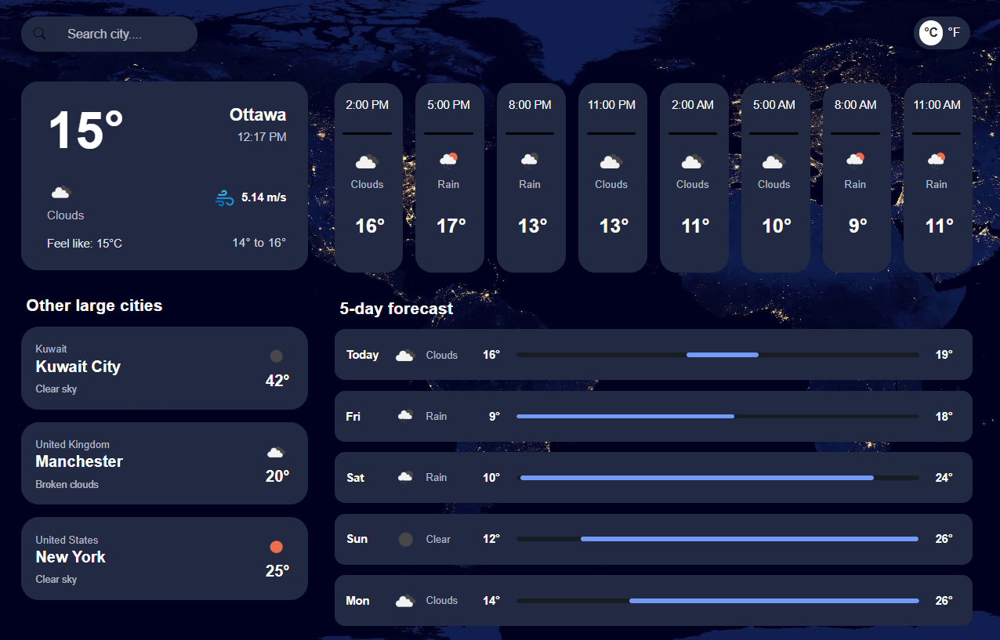
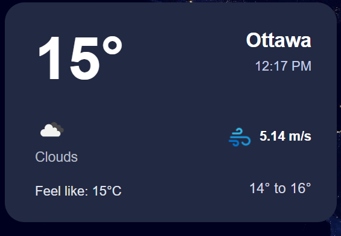
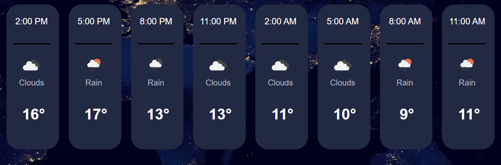
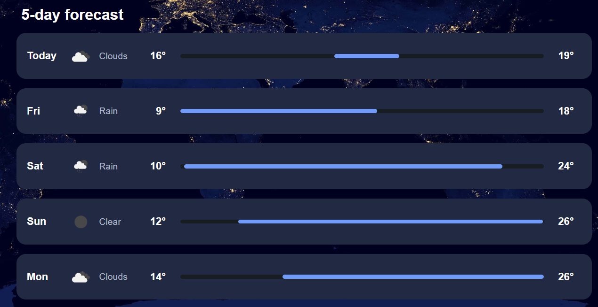
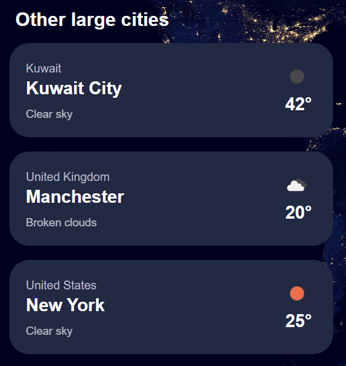
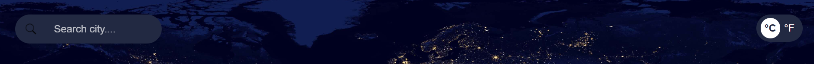

# 🌤️ Weather App

A modern weather forecast application built with **React** and the **OpenWeatherMap API**.  
It allows users to search for cities, view the current weather, check an **hourly forecast (24h)**, and see a **5-day forecast**.  
Users can also toggle between **Celsius and Fahrenheit** and view summaries for a few major world cities.

---

## 🌐 Live Demo
- 👉 **Frontend:** [View Website Live]()

---

## 🚀 Features
- 🔍 **City Search** - Search for any city and instantly see its weather.
- 🌡️ **Temperature Toggle** - Switch between Celsius (°C) and Fahrenheit (°F).
- 📊 **Current Weather** - See temperature, wind, conditions, and local time for a city.
- ⏱️ **Hourly Forecast** - Displays 3-hour interval data for the next 24 hours.
- 📅 **5-Day Forecast** - Shows min/max temperature and conditions per day.
- 🌍 **Other Large Cities** - Quick access to weather in major preset cities.
- 📱 **Responsive Design** - Works seamlessly on desktop, tablet, and mobile.

---

## 🛠️ Tech Stack
- **Frontend:** React, JavaScript, CSS  
- **API:** [OpenWeatherMap API](https://openweathermap.org/)
- **Deployment:** Vercel (Frontend)

---

## 📸 Screenshots

| Home | Current Weather | Hourly Forecast | Daily Forecast | Other Large Cities | Search + Toggle|
|---|---|---|---|---|---|
|  |  |  |  |  |  |

---

## ⚙️ Installation & Setup

To run this project locally, follow these steps:

```bash
# 1. Clone the repository
git clone https://github.com/abdullaabdulla97/weather-app-project.git
cd weather-app-project/Frontend

# 2. Install dependencies
npm install

# 3. Create a .env file inside the Frontend folder
# (This will store your OpenWeatherMap API key securely)
echo "REACT_APP_WEATHER_API_KEY=your_api_key_here" > .env

# 4. Start the frontend development server
npm start
```
---

## 📬 Contact
-  LinkedIn: [LinkedIn](https://www.linkedin.com/in/abdulla-abdulla-350a0937b/)  
- 📧 Email: abdulla.abdulla.salem97@gmail.com  
-  GitHub: [GitHub](https://github.com/abdullaabdulla97)

---